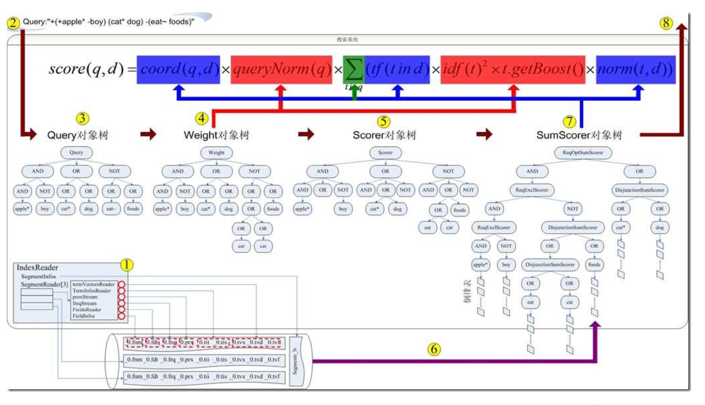
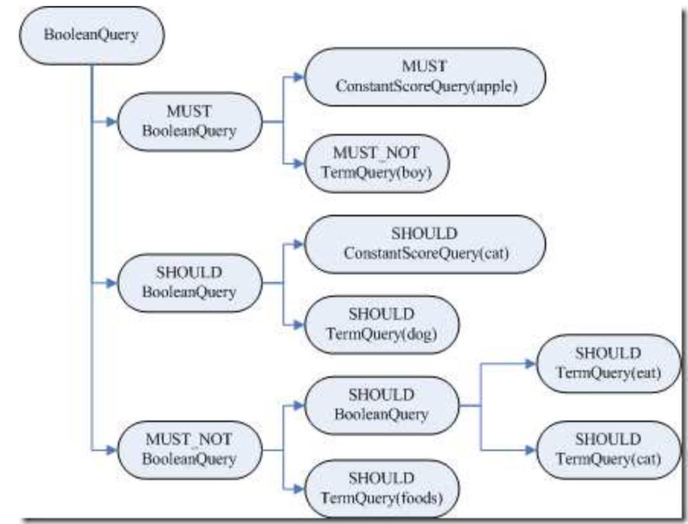
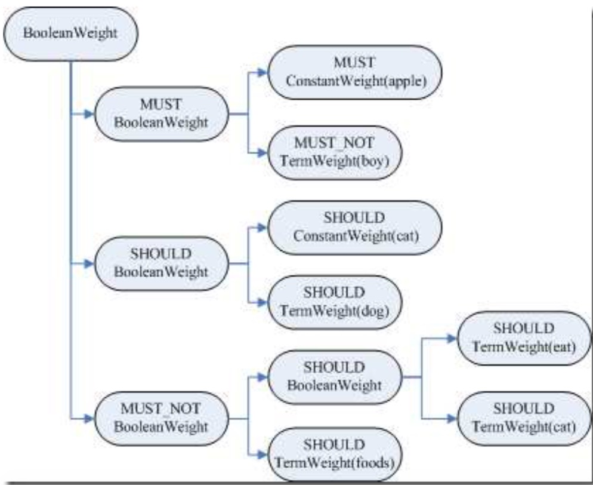
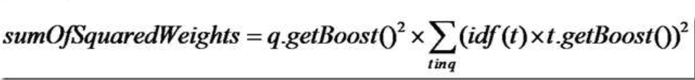
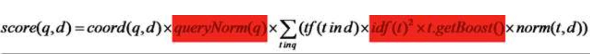

# Lucene 搜索流程
 搜索的过程总的来说就是将词典及倒排表信息从索引中读出来，根据用户输入的查询语句合并倒排表，得到结果文档集并对文档进行打分的过程。
 

+ IndexReader 打开索引文件，读取并打开指向索引文件的流。
+ 用户输入查询语句
+ 将查询语句转换为查询对象 Query 对象树
+ 构造 Weight 对象树，用于计算词的权重 Term Weight （红色部分）
+ 构造 Scorer 对象树，用于计算打分(TermScorer.score())
+ 构造 Scorer 对象树同时，其叶子节点的 TermScorer 将词典和倒排表从索引中
读出
+ 构造 SumScorer 对象树，将倒排表合并后得到结果文档集，并对结果文档计算打分公式中的蓝色部分
+ 返回结果集合及得分

# Lucene 搜索详细
## 打开 IndexReader
通过加载搜索文件夹，创建 IndexReader：

```
  IndexReader reader = IndexReader.open(FSDirectory.open(indexDir));
```
主要作用是生成一个 SegmentInfos.FindSegmentsFile 对象，并用它来找到此索引文 件中所有的段，并打开这些段。
SegmentInfos.FindSegmentsFile.run(IndexCommit commit)主要做以下事情:
### 找到最新的 segment_N 文件
通过 segment_N 和 segment_gen 获取最大 gen，并用此 gen 构造要打开的 segments_N 的文件名

### 通过 segment_N 文件的各个段的信息打开各个段 
+ 从 segment_N 中读出段的元数据信息，生成 SegmentInfos 
    
```
 SegmentInfos infos = new SegmentInfos();    
 infos.read(directory, segmentFileName);
```
+ 根据生成的 SegmentInfos 创建每个段对象 SegmentInfo(即打开各个段)，并生成 ReadOnlyDirectoryReader
+ 初始化生成的 ReadOnlyDirectoryReader，对打开的多个 SegmentReader 中的文档编号

### IndexReader 特性
+ 段元数据信息已经被读入到内存中，因而索引文件夹中因为新添加文档而新增加的段对
已经打开的 reader 是不可见的。
+ .del 文件已经读入内存，因而其他的 reader 或者 writer 删除的文档对打开的 reader 也是
不可见的。
+ IndexReader打开一个索引，无论背后索引如何改变，此 IndexReader 在被重新打开之前，看到的信息总是相同的。

## 打开 IndexSearcher
通过 IndexReader 打开 IndexSearcher：

```
   IndexSearcher searcher = new IndexSearcher(reader);    
```

IndexSearcher 是 IndexReader 的一个封装，很多函数也是调用 reader，同时提供了两个非常重要的函数：  

+ void setSimilarity(Similarity similarity)，用户可以实现自己的 Similarity 对象，从而影响搜索过程的打分
+ 一系列 search 函数，是搜索过程的关键，**主要负责打分的计算和倒排表的合并**。（PS：在查询中，只想得到某个词的倒排表的时候，不需要计算得分时最好不要用 IndexSearcher，直接用 IndexReader.termDocs(Term term)）

## QueryParser 解析查询语句生成查询对象
+ JavaCC 解析器根据 JavaQuery.jj 文件得到 QueryParser
+ 设置 Analyser 分析器，构造得到 QueryNode
+ 解析查询语句，得到 QueryNodeTree
+ 通过 QueryBuilder 重构构造 Query 对象

## 搜索查询对象
```
TopDocs docs = searcher.search(query, 50);
```
其最终调用 search(createWeight(query), filter, n);
索引过程包含以下子过程:   

+ 创建 weight 树，计算 term weight
+ 创建 scorer 及 SumScorer 树，为合并倒排表做准备
+ 用 SumScorer 进行倒排表合并
+ 收集文档结果集合及计算打分

### 创建 Weight 对象树，计算 Term Weight
代码如下：

```
protected Weight createWeight(Query query) throws IOExpection{
    return query.weight(this)
}
```
主要的步骤：重写 Query 对象树、创建 Weight 对象树、计算 Term Weight 分数。  
**1.重写 Query 对象树**      
通过 BoolQuery 的 rewrite函数对 MultiTermQuery(多个 Term 参与查询)进行重写，PrefixQuery或FuzzyQuery等此类查询必须进行重写。  

+ 获取符合条件的所有 Term
+ 将上述Term重新组织成新的 Query 对象进行查询，两种方式：
  1. 使用BoolQuery:OR 关系，Query 对象树被展开，叶子节点都为 TermQuery，可根据索引中tf、idf打分计算，但是可能产生 TooManyClauses异常(太多Term)
  2. 看成一个Term，将文档号封装成一个docId Set作为统一的倒排表参与合并：不会有TooManyClauses，但多个Term间的tf,idf等将被忽略，所以采用 ConstantScoreXXX（除了用户指定的 Query boost，其他的打分计算全部忽略）   

为了兼顾上述两种方式，Lucene提供了ConstantScoreAutoRewrite，来根据不同的情况，选择不同的方式。
 

**2.创建 Weight 对象树**   
BooleanQuery.createWeight(Searcher) 最终返回对象：new BooleanWeight(searcher)    

+ TermQuery 的叶子节点: **TermQuery.createWeight(Searcher) 创建了 TermWeight(searcher) 对象，并且计算了 tf *idf (tf-idf，已经升级为 BM25)**
+ ConstantScoreQuery 叶子节点: **ConstantScoreQuery.createWeight(Searcher) 只创建了 ConstantWeight(searcher)对象，没有计算 idf** 
   

**3.计算 Term Weight 分数**   

* 计算 sumOfSquaredWeights
  根据创建的 weight 对象树，**树形结构**,递归计算 sumOfSquaredWeights，公式如下：
  
* 打分也以递归方式加入 queryNorm，公式：
  
* lucene 整理打分公式：
  
  **红色部分代表已经计算**    
  
### 创建 Scorer 及 SumScorer 对象树
接下来的主要流程： 创建 Scorer 对象树，SumScorer树合并倒排表，合并倒排表，创建文档结果收集器，收集文档并返回  


